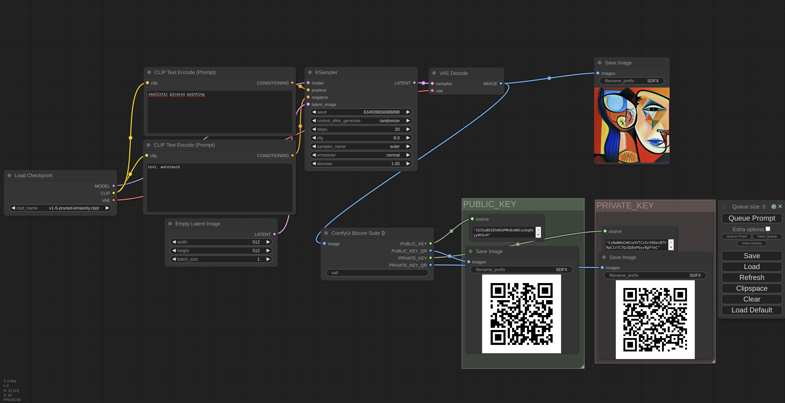

# Bitcoin Suite - ComfyUi ₿

## A Node Suite for ComfyUI with Bitcoin Superpowers!

Turn any image, whether it's from your PC or generated by ComfyUi workflow, into a Bitcoin wallet! 
This project is all about the thrill of discovering Bitcoin wallet generation from images or ComfyUi workflows.



## Disclaimer

> Hey there! Just a quick heads-up, this project isn't intended to be a secure means of storing your Bitcoin private keys. After all, any DIY "mechanism" (like this repo) or attempt to beef up Bitcoin wallet security is a bit risky. So, only use this project for fun and to explore the world of custom comfy nodes and Bitcoin wallet generation. I can't be held responsible for any Bitcoin losses due to using this repo.

## To-Do

Got ideas or requests? Drop them in the Reddit topic associated with this project. 
Feel free to open pull requests to add nodes to this suite pack.

## Installation

    ```
    cd custom_nodes
    git clone https://github.com/spartanz51/ComfyUi-bitcoin-suite.git
    cd ComfyUi-bitcoin-suite
    pip install -r requirements.txt
    ```
    
## Usage

Launch ComfyUi, then simply drag and drop the example workflow

## Development

Feeling inspired? Awesome!
Feel free to contribute to this suite of Nodes to implement interesting concepts revolving around Bitcoin and ComfyUi - all while keeping that media/bitcoin theme alive! 🎉
